

  

<h1 align="center">Wake Up Darling ❤️</h1>

  
  
  

  <strong>Wake Up Darling</strong> is a couple-based smart alarm application that helps partners wake each other up, stay connected, and track their wake-up consistency through interactive features.

---

## 🌟 Features

- 🔔 **Couple Smart Alarm** — Set alarms that connect you with your partner
- 💤 **Wake Your Partner** — Send wake-up requests directly to your partner
- 🚨 **Emergency Wake Alarm** — Trigger a high-priority alarm when urgent attention is needed
- 💬 **Real-time Chat with Partner** — Built-in private messaging for couples
- 🎙️ **Voice Message Support** — Send and receive voice messages
- 🔥 **Wake Streak Tracking** — Track successful wake attempts and maintain streaks
- 📊 **Relationship Statistics** — View total wake attempts, streaks, and insights
- 📱 **Alarm Status Monitoring** — Check whether your partner responded to alarms
- 🔐 **Secure Authentication** — Safe and secure login system
- 🔕 **Smooth Background Alarm Execution** — Reliable alarms even when the app is closed

---

## 📥 Download APK

Download the latest version of **Wake Up Darling** for Android.

  

**🔗 [https://github.com/S-G-Rathenesh/wake-up-darling/releases/latest](https://github.com/S-G-Rathenesh/wake-up-darling/releases/latest)**

### Installation Instructions

1. Download the APK from the link above
2. Allow **"Install from Unknown Sources"** on your Android device
3. Install and open the app
4. Login and connect with your partner

---

## 📸 Screenshots

  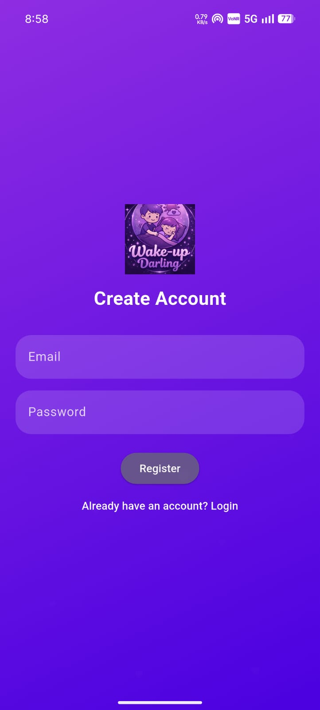
  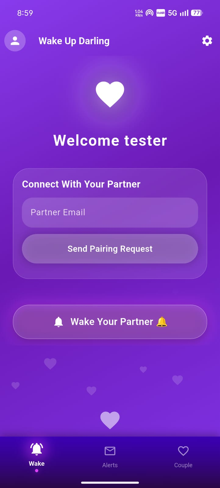
  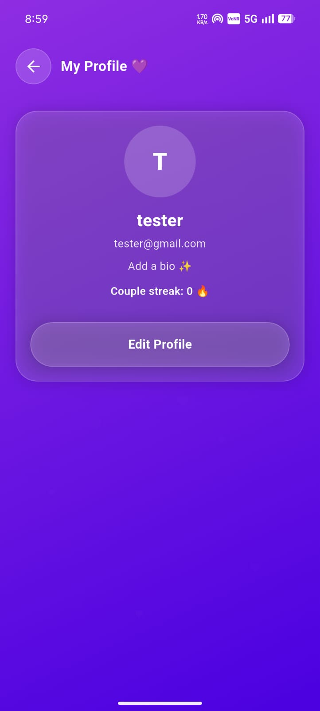
  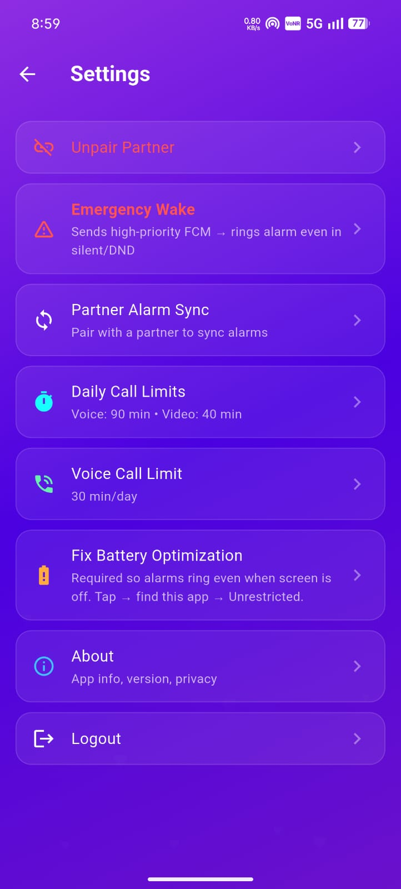

  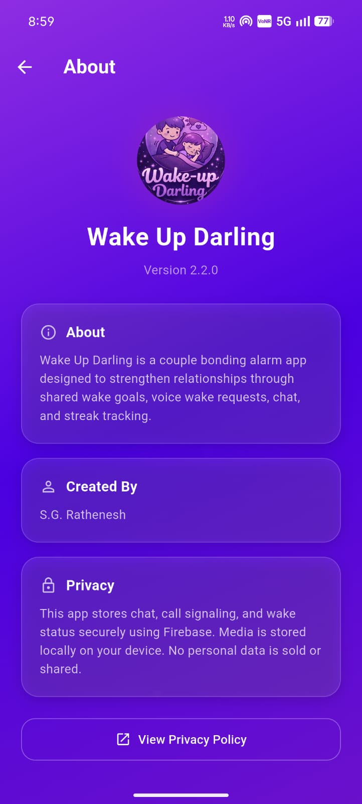
  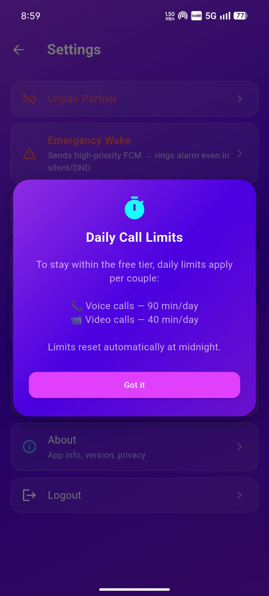
  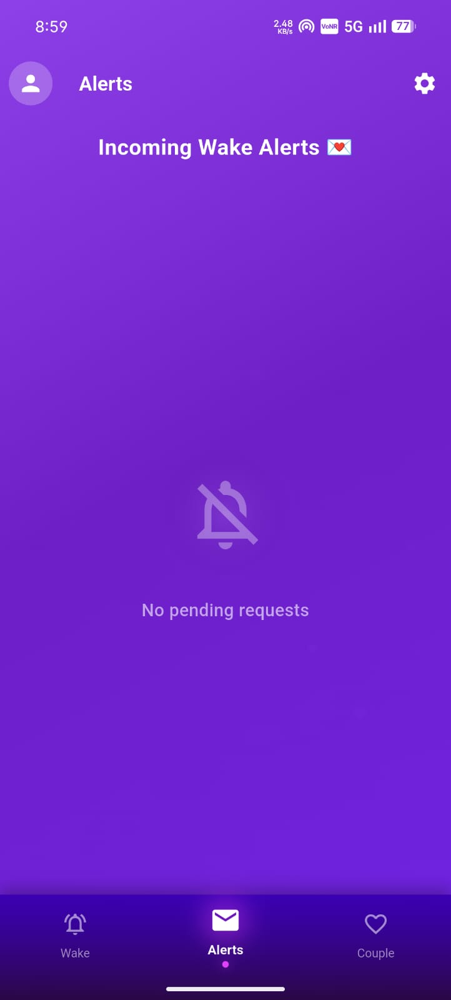
  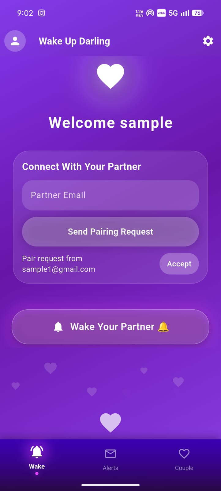

  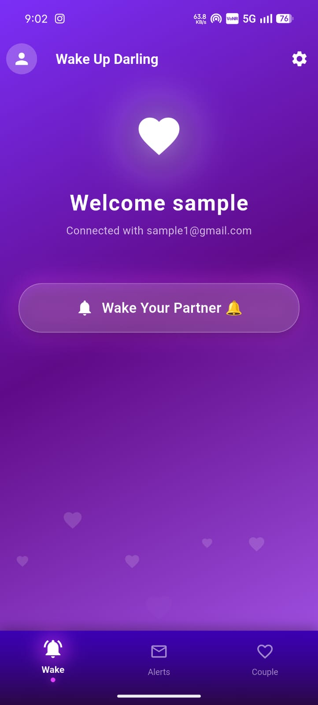
  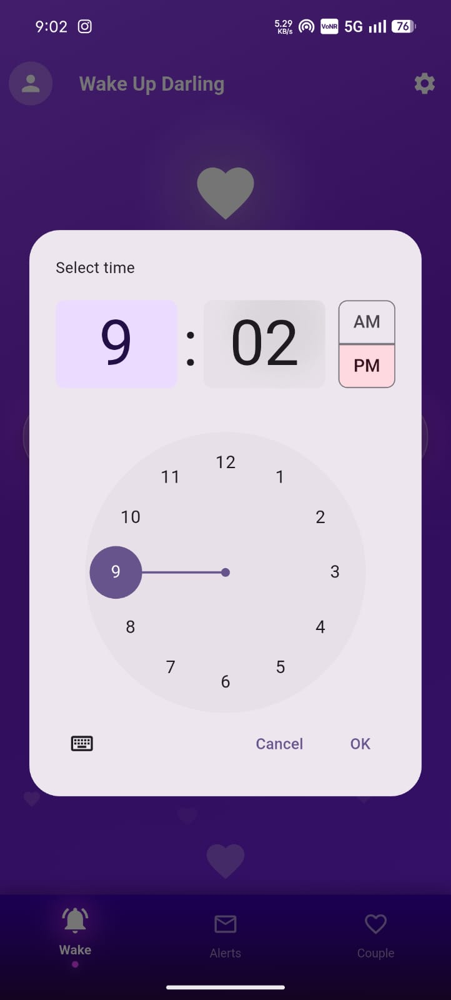
  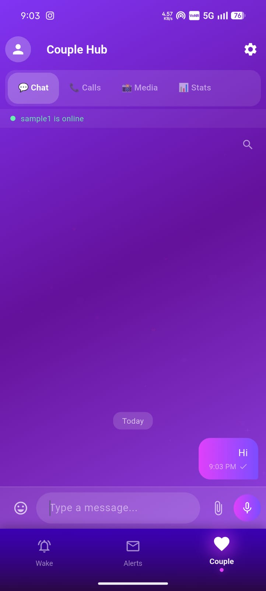
  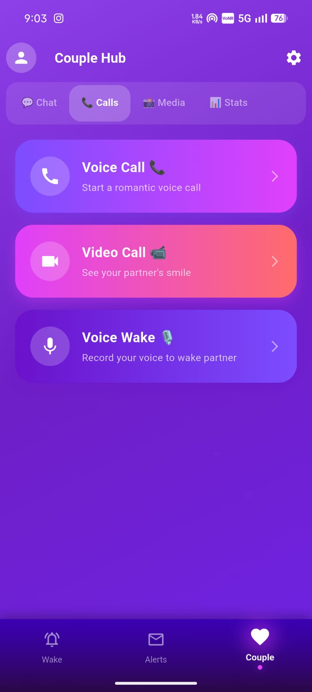

  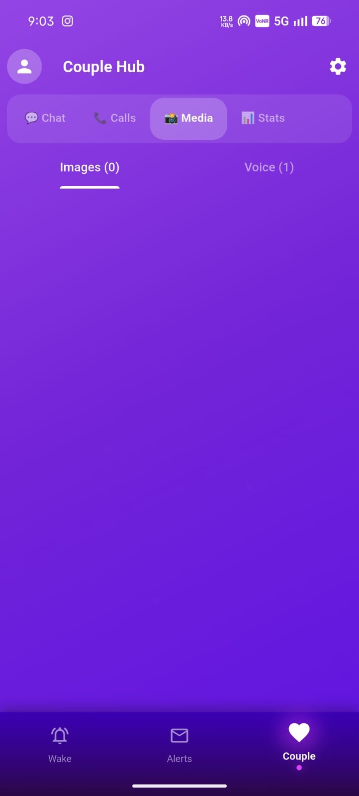
  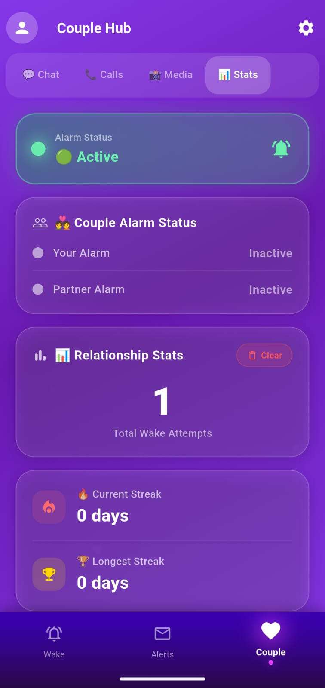
  
  

---

## 🔒 Privacy Policy

We value your privacy. Read our full privacy policy here:

📄 **[Privacy Policy → PRIVACY_POLICY.md](PRIVACY_POLICY.md)**

---

## 📄 License

This project is licensed under the **MIT License** — see the [LICENSE](LICENSE) file for details.

---

  Developed with ❤️ by <strong>S.G. Rathenesh</strong>

