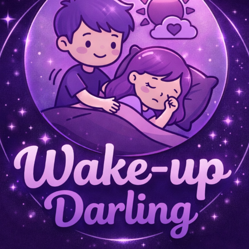

  

<h1 align="center">Wake Up Darling ❤️⏰</h1>

A couple-based smart alarm app to strengthen your relationship

  
  
  
  

---

## 🚀 Features

| Feature | Description |
|----------|------------|
| 🔔 Smart Wake Requests | Send wake-up requests directly to your partner |
| 🚨 Emergency Wake Mode | High-priority emergency alarm |
| 💬 Real-Time Chat | Private couple messaging |
| 📞 Voice & Video Calling | Daily limited free tier control |
| 🔥 Wake Streak Tracking | Track successful wake attempts |
| 📊 Stats Dashboard | View streaks & insights |
| 🔐 Secure Authentication | Firebase-based login |
| 🗂 Private Media Storage | Stored in app-only local storage |

---

## 🔐 Privacy

- Media stored in **private app storage**
- Not visible in gallery
- One-time images auto-delete
- Secure encrypted communication

See full Privacy Policy inside the app.

---

## 📥 Download

👉 **Latest Version:**  
[Download Wake Up Darling v2.1.0](https://github.com/S-G-Rathenesh/wake-up-darling/releases/download/v2.1.0/WakeUpDarling_v2.1.0.apk)

---

Built with ❤️ using Flutter
